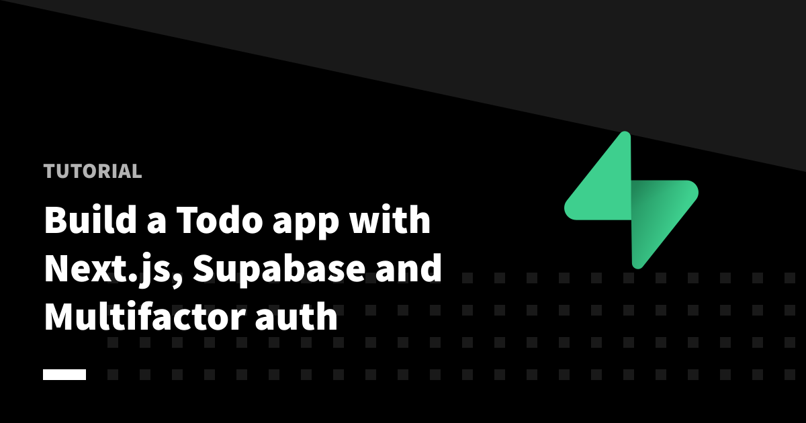

# Next.js + Supabase + Clerk Todo App

  

This demo repo represents the final state of the Next.js todo app built with a Supabase database and Clerk for multifactor authentication. You can follow along with [this guide](https://clerk.dev/blog/nextjs-supabase-todos-with-multifactor-authentication?utm_source=github&utm_medium=tutorial_repos&utm_campaign=supabase) to build it yourself.

## Contact

If you need support or have anything you would like to ask, please reach out on our [Discord channel](https://discord.com/invite/b5rXHjAg7A). We'd love to chat!

